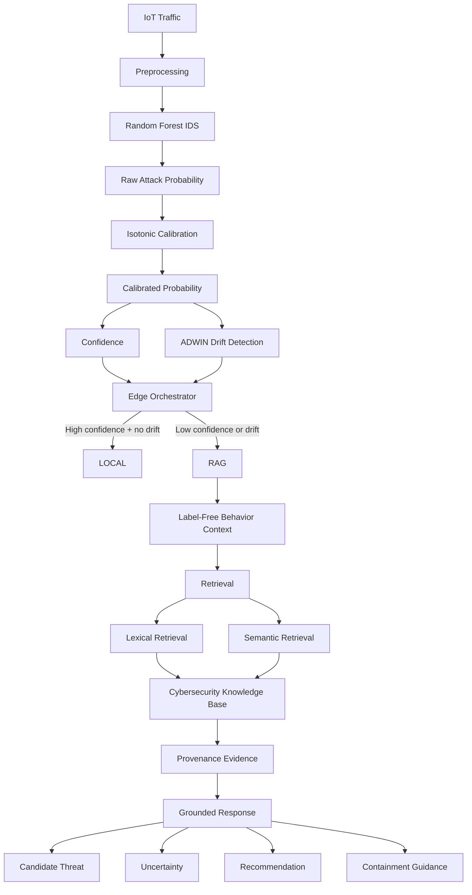

<div align="center">

# 🛡️ IoT Edge-AI Cybersecurity Framework

### Resource-Efficient • Uncertainty-Aware • Continually Adaptive

**Detect locally. Escalate selectively. Retrieve responsibly.**

An end-to-end research prototype for detecting known and emerging IoT cyber threats at the edge, monitoring prediction uncertainty and concept drift, and selectively escalating difficult cases to a provenance-aware cybersecurity RAG layer.

<p>
  
  
  
  
  
  
</p>

</div>

---

## 🚀 At a Glance

| | |
|---|---:|
| **Dataset** | CIC-IoT-2023 |
| **Processed samples** | ~2.21M |
| **Network-flow features** | 39 |
| **Held-out emerging classes** | 3 |
| **Controlled end-to-end evaluation** | 20,000 samples |
| **Local routing** | **80.30%** |
| **RAG routing** | **19.71%** |
| **RAG workload avoided vs Always-RAG** | **80.30%** |
| **Known-test IDS recall** | **98.90%** |
| **Known-test IDS F1** | **99.44%** |
| **Emerging-test IDS recall** | **34.67%** |
| **Retrieval benchmark cases** | 8 |
| **Automated tests** | **9/9 passing** |

> These are results from the current controlled research evaluation. They are not universal production-performance guarantees.

---

# 🎯 What Did We Build?

Traditional intrusion detection asks:

> **Is this traffic malicious?**

This project adds another question:

> **Does this case require additional cybersecurity reasoning?**

The framework therefore uses a two-level architecture:

### ⚡ Level 1 — Edge AI
A lightweight Random Forest performs the first-stage intrusion-detection task locally.

### 🧭 Level 2 — Cybersecurity Knowledge
Only selected cases are escalated to a provenance-aware RAG layer.

The routing decision is driven by:

- prediction confidence;
- calibrated attack probability;
- concept-drift information.

The central research contribution is **selective orchestration**, not simply combining Random Forest, RAG, uncertainty, and drift detection as separate technologies.

---

# 🏗️ Architecture



---

# 💡 Core Research Idea

The architecture follows:

```text
IoT Traffic
    ↓
Preprocessing
    ↓
Edge ML IDS
    ↓
Probability Calibration
    ↓
Confidence + Drift Monitoring
    ↓
Edge Orchestrator
    ↓
┌───────────────────────────────────┐
│ High confidence + no drift        │ → LOCAL
│ Low confidence OR drift            │ → RAG
└───────────────────────────────────┘
    ↓
Cybersecurity Evidence
    ↓
Grounded Explanation
    ↓
Mitigation Guidance
```

The goal is to avoid sending every event through a heavier cybersecurity-reasoning layer.

---

# 📌 Problem Statement

Design and develop a **resource-efficient, uncertainty-aware, continually adaptive Edge-AI cybersecurity framework for IoT networks** that detects known and emerging cyber threats under evolving network conditions.

The framework is designed to:

- perform lightweight intrusion and anomaly detection at the edge;
- monitor prediction uncertainty;
- identify changes in traffic behavior through concept-drift monitoring;
- dynamically determine whether a case can be handled locally;
- selectively invoke a provenance-aware RAG pipeline for difficult or uncertain cases;
- retrieve relevant cybersecurity evidence;
- generate evidence-grounded threat interpretation;
- provide context-specific mitigation guidance;
- minimize unnecessary RAG/LLM interactions;
- maintain low response latency and reasonable edge resource usage.

---

# 🌟 Why This Architecture?

A single ML classifier may be very good at identifying malicious traffic while still being weak at answering:

> **What cybersecurity knowledge should an analyst consult next?**

This project therefore separates:

| Layer | Responsibility |
|---|---|
| ⚡ Edge ML | Fast first-stage detection |
| 📏 Calibration | Improve probability interpretation |
| 🌊 Drift Detection | Identify changing prediction behavior |
| 🧭 Orchestrator | Decide LOCAL vs RAG |
| 📚 Knowledge Base | Store trusted cybersecurity knowledge |
| 🔎 Retrieval | Find relevant evidence |
| 🧾 Grounded Generator | Produce evidence-supported interpretation |
| 🛠️ Recommendations | Provide mitigation/containment guidance |

---

# 🧠 Main Contributions

## 1. Lightweight Edge-AI Intrusion Detection

A Random Forest classifier performs binary intrusion detection from IoT network-flow features.

The first-stage prediction is:

```text
BENIGN
ATTACK
```

---

## 2. Probability Calibration

Random Forest probability outputs are calibrated using:

**Isotonic Regression**

This calibrated probability is then used by the routing layer as an uncertainty signal.

---

## 3. Concept-Drift Monitoring

The framework uses:

**ADWIN — Adaptive Windowing**

from the River library to monitor the calibrated attack-probability stream.

---

## 4. Selective Security Escalation

The Edge Orchestrator chooses between:

```text
LOCAL
```

and:

```text
RAG
```

based on prediction confidence and drift information.

---

## 5. Provenance-Aware Cybersecurity RAG

The RAG subsystem retrieves information from source-linked cybersecurity knowledge records covering:

- MITRE ATT&CK
- NIST
- OWASP
- CISA
- CWE

---

## 6. Evidence-Grounded Response Generation

The response contains structured fields for:

- candidate threat;
- detection interpretation;
- uncertainty reason;
- likely behavior;
- recommendation;
- containment guidance;
- caveat;
- evidence.

---

## 7. Research-Oriented Evaluation

The repository contains experiments covering:

- binary IDS performance;
- emerging-attack performance;
- confidence analysis;
- probability calibration;
- concept drift;
- threshold analysis;
- routing-policy comparison;
- three-system ablation;
- Selective-RAG vs Always-RAG;
- emerging false-negative escalation;
- emerging evidence alignment;
- lexical vs semantic retrieval;
- orchestrator latency;
- CPU and memory measurements;
- end-to-end integration.

---

# 📊 Dataset

## CIC-IoT-2023

The project uses the **CIC-IoT-2023** dataset.

Locally, the downloaded data is organized into five merged CSV partitions:

```text
Merged01.csv
Merged02.csv
Merged03.csv
Merged04.csv
Merged05.csv
```

These are partitions of the **same dataset**, not five independent datasets.

---

## Processed Dataset

| Property | Value |
|---|---:|
| Rows | ~2,207,338 |
| Columns | 41 |
| Network-flow features | 39 |
| Label fields | 2 |

Binary distribution:

```text
ATTACK  = 2,123,497
BENIGN  =    83,841
```

---

## Feature Groups

The feature set includes:

- header and packet statistics;
- protocol indicators;
- TCP flags;
- application-protocol indicators;
- traffic rate/count features;
- packet-size statistics;
- inter-arrival time;
- statistical/variance features.

---

# 🚨 Emerging-Threat Evaluation

Three attack classes were held out from model training:

```text
DNS_SPOOFING
VULNERABILITYSCAN
DOS-HTTP_FLOOD
```

The experimental design therefore separates:

```text
Known attacks
    ↓
Model development / evaluation

Emerging attacks
    ↓
Held out from model training
```

### Important

The known/emerging split is a **controlled held-out-class evaluation**.

It is **not claimed to be a natural chronological deployment stream**.

---

# 🤖 Machine Learning Pipeline

## Stage 1 — Binary IDS

The first Random Forest predicts:

```text
BENIGN
ATTACK
```

### Configuration

```text
n_estimators = 100
max_depth = 20
class_weight = balanced
random_state = 42
n_jobs = -1
```

Model artifact:

```text
models/binary_ids_random_forest.joblib
```

Model artifacts are intentionally excluded from GitHub because they are large/generated files.

---

## Known-Test Performance

| Metric | Result |
|---|---:|
| Precision | **99.99%** |
| Recall | **98.90%** |
| F1-score | **99.44%** |

---

## Emerging-Test Performance

| Metric | Result |
|---|---:|
| Precision | **100.00%** |
| Recall | **34.67%** |
| F1-score | **51.49%** |

The large recall drop on unseen attack classes motivates the use of an additional cybersecurity knowledge layer.

---

# 🎯 Attack-Type Classifier

A second Random Forest is trained on known attack classes to classify the attack family/type after malicious traffic has been identified.

```text
Known attack classes = 30
Held-out emerging classes = 3
```

Model artifact:

```text
models/attack_type_random_forest.joblib
```

### Known-Test Performance

| Metric | Result |
|---|---:|
| Accuracy | **~78%** |
| Macro F1 | **0.626** |
| Weighted F1 | **0.775** |

The lower macro F1 reflects the difficulty of distinguishing rare and imbalanced attack classes.

---

# 📏 Probability Calibration

The system uses:

```text
Random Forest
      ↓
Raw attack probability
      ↓
Isotonic Regression
      ↓
Calibrated attack probability
      ↓
Confidence
      ↓
Routing
```

The calibration model is trained on the **validation set only**.

Artifact:

```text
models/attack_probability_calibrator.joblib
```

---

## Brier Score Improvement

| Split | Raw | Calibrated |
|---|---:|---:|
| Validation | 0.009203 | **0.006140** |
| Known test | 0.009128 | **0.006095** |
| Emerging | 0.561658 | **0.259323** |

Calibration improves measured probability quality, although uncertainty remains imperfect under distribution shift.

---

# 🌊 Concept Drift Detection

The streaming layer uses:

**ADWIN**

from River.

Configuration:

```text
delta = 0.002
```

ADWIN monitors the calibrated attack-probability stream and identifies changes in its distribution.

---

## Drift Experiment Interpretation

The controlled experiment transitions from:

```text
KNOWN
  ↓
EMERGING
```

The observed drift event occurred near the transition.

However:

> Drift produced no additional unique RAG escalations beyond those already generated by low-confidence routing in the evaluated stream.

This is retained as a **negative research finding** rather than hidden.

---

# 🧭 Edge Orchestrator

The Edge Orchestrator connects the ML layer to the RAG layer.

### Inputs

```text
prediction
raw_probability
calibrated_probability
confidence
drift_detected
```

### Outputs

```text
prediction
raw_probability
calibrated_probability
confidence
drift_detected
routing_decision
routing_reason
```

---

## Routing Policy

Default confidence threshold:

```text
0.70
```

| Confidence | Drift | Decision |
|---|---|---|
| High | No | ✅ LOCAL |
| Low | No | 🔎 RAG |
| High | Yes | 🔎 RAG |
| Low | Yes | 🔎 RAG |

The threshold is treated as a **resource-aware engineering/research trade-off**, not as a globally optimal mathematical threshold.

---

# ⚖️ Adaptive Threshold Analysis

| Threshold | RAG Invocation | FN Escalation |
|---:|---:|---:|
| 0.60 | 6.63% | 19.50% |
| 0.65 | 9.86% | 29.01% |
| **0.70** | **19.84%** | **58.38%** |
| 0.75 | 22.34% | 65.58% |
| 0.80 | 24.31% | 71.22% |
| 0.85 | 26.82% | 78.12% |
| 0.90 | 30.73% | 89.16% |

The selected operating point is:

```text
0.70
```

because it provides a practical trade-off between RAG workload and broader false-negative escalation coverage.

---

# 🔎 RAG Architecture

The RAG layer is separated from the edge detector.

```text
RAG Request
    ↓
Behavior Context
    ↓
Retrieval Query
    ↓
┌─────────────────────────┐
│ Lexical Retrieval       │
│ Semantic Retrieval      │
└─────────────────────────┘
    ↓
Provenance Evidence
    ↓
Grounded Response
    ↓
Threat + Explanation
+ Uncertainty
+ Recommendation
+ Containment
+ Evidence
```

---

# 🧩 RAG Request Contract

The structured RAG request contains:

```text
prediction
raw_probability
calibrated_probability
confidence
drift_detected
routing_reason
behavior_context
```

`behavior_context` is optional and carries observable network behavior.

The ground-truth label is deliberately not passed into the RAG inference path.

---

# 🧠 Label-Free Behavior Context

The RAG layer receives information derived from observable network-flow features such as:

```text
active_protocols
active_application_protocols
active_tcp_flags
traffic_statistics
retrieval_query
```

The following evaluation labels are excluded from the runtime RAG context:

```text
Label
Label_Binary
```

This separation prevents the evaluation answer from being directly exposed to the RAG system.

---

# 📚 Cybersecurity Knowledge Base

Active corpus:

```text
knowledge_base/cybersecurity_sources_expanded.json
```

Current size:

```text
37 source-linked records
```

Coverage includes:

### MITRE ATT&CK
- Network Service Scanning
- Brute Force
- Exploitation of Remote Services
- Network Denial of Service
- Service Exhaustion / HTTP Flooding
- Name Resolution Poisoning

### NIST
- IoT security capabilities
- device security state
- incident response
- incident analysis
- containment

### OWASP
- Command Injection
- SQL Injection
- Denial of Service

### CISA
- DDoS guidance

### CWE
- Hard-coded Credentials

---

# 🔐 Why Provenance Matters

The system is designed so that cybersecurity responses do not appear without supporting evidence.

Retrieved evidence is carried into the response so that an analyst can trace the recommendation and interpretation back to the cybersecurity source material used by the pipeline.

Each knowledge record contains provenance-related information such as:

```text
source identity
document identifier
chunk identifier
document title
document type
topic / attack family
source URL
content
```

---

# 🔬 Retrieval Engine

The project supports two retrieval methods.

## 1. Lexical Retrieval

Uses transparent token-overlap matching over fields such as:

```text
document_title
document_type
topic
attack_family
content
```

Advantages:

- lightweight;
- deterministic;
- transparent;
- easy to inspect.

---

## 2. Semantic Retrieval

Uses:

```text
Sentence Transformers
all-MiniLM-L6-v2
```

Embedding dimension:

```text
384
```

The embedding model and document embeddings are loaded/cached lazily.

---

# 📈 Retrieval Benchmark

The retrieval benchmark contains **8 hand-authored cybersecurity cases** covering:

- vulnerability scanning;
- DNS-related behavior;
- HTTP flooding;
- brute force;
- command injection;
- SQL injection;
- network denial of service;
- IoT security.

### Results

| Metric | Lexical | Semantic |
|---|---:|---:|
| Hit@1 | **1.000** | **1.000** |
| Hit@3 | **1.000** | **1.000** |
| Hit@4 | **1.000** | **1.000** |
| MRR | **1.000** | **1.000** |
| Precision@1 | **1.000** | **1.000** |
| Precision@3 | 0.917 | 0.833 |
| Precision@4 | 0.813 | 0.719 |
| Recall@4 | 0.813 | 0.750 |
| NDCG@4 | 0.925 | 0.860 |

> These values apply specifically to the eight-case retrieval benchmark. They should not be interpreted as universal retrieval performance.

---

# 🧾 Grounded Response Generation

The current implementation uses a:

**Deterministic Grounded Generator**

This provides a reproducible offline baseline.

The generator:

1. receives the RAG request;
2. receives retrieved evidence;
3. validates cited evidence identifiers;
4. derives a candidate threat interpretation from retrieved evidence;
5. produces structured explanation fields;
6. selects evidence-grounded recommendations;
7. preserves provenance;
8. includes a caveat about the deterministic baseline.

### Response fields

```text
Threat
Detection Interpretation
Uncertainty Reason
Likely Attack Behavior
Recommendation
Containment Action
Caveat
Evidence
```

### Important

This generator is **not a production autonomous cybersecurity LLM**.

The architecture provides a clean interface for a future real LLM adapter.

---

# 🔄 End-to-End Evaluation

Implementation:

```text
src/run_end_to_end.py
```

Controlled stream:

```text
10,000 KNOWN
10,000 EMERGING
----------------
20,000 TOTAL
```

---

## Routing Results

| Decision | Samples | Percentage |
|---|---:|---:|
| ✅ LOCAL | 16,059 | **80.30%** |
| 🔎 RAG | 3,941 | **19.71%** |

### Phase-wise Routing

| Phase | LOCAL | RAG |
|---|---:|---:|
| KNOWN | **98.58%** | 1.42% |
| EMERGING | **62.01%** | **37.99%** |

---

## Deterministic Offline RAG Timing

| Measurement | Mean |
|---|---:|
| Retrieval | **0.074 ms** |
| Generation | **0.005 ms** |
| Total RAG | **0.140 ms** |

> These timings describe the local deterministic implementation and should not be interpreted as production LLM/API latency.

---

# ♻️ Selective-RAG vs Always-RAG

A dedicated experiment compares the proposed selective strategy with an Always-RAG baseline.

## Always-RAG

Every sample invokes RAG:

```text
20,000 / 20,000
= 100%
```

## Selective-RAG

Only routed cases invoke RAG:

```text
3,941 / 20,000
= 19.71%
```

---

## Workload Reduction

```text
20,000 - 3,941
= 16,059 RAG calls avoided
```

Therefore:

```text
RAG workload reduction
= 80.30%
```

Measured cumulative deterministic RAG latency reduction:

```text
≈ 80.53%
```

### Correct interpretation

This demonstrates reduced RAG workload under the evaluated deterministic offline implementation.

It should **not** be directly generalized into claims such as:

```text
"80% lower real-world LLM cost"
"80% lower cloud cost"
"80% lower production power consumption"
```

---

# 🧪 Three-System Ablation

The project includes a routing ablation with three systems.

## A — EDGE_ML_ONLY

```text
Random Forest
     ↓
LOCAL
```

No RAG escalation.

---

## B — ML_PLUS_CONFIDENCE_RAG

```text
confidence < 0.70
        ↓
      RAG
```

---

## C — PROPOSED_CONFIDENCE_PLUS_DRIFT_RAG

```text
confidence < 0.70
        OR
drift_detected
        ↓
      RAG
```

---

## Why This Ablation Matters

All three systems reuse the same:

- ML predictions;
- probabilities;
- evaluated samples.

Therefore:

> Routing does not change the Random Forest prediction itself.

The ablation isolates the effect of:

- RAG allocation;
- emerging false-negative escalation;
- drift-aware routing.

### Observed result

In the current controlled stream:

> **Drift awareness produced no additional unique RAG escalations beyond confidence-based routing.**

This result is retained honestly.

---

# 🌊 Drift Adaptation Evaluation

The drift experiment compares:

```text
CONFIDENCE_ONLY
```

against:

```text
CONFIDENCE_PLUS_DRIFT
```

using a symmetric window around the first detected drift event.

The evaluation measures:

- RAG invocation rate;
- false-negative escalation;
- false negatives remaining local;
- drift-only escalations;
- additional RAG invocations caused by drift.

### Result

The detected drift event did not contribute additional unique escalations because the affected samples were already below the confidence threshold.

This means:

```text
Incremental drift-only routing contribution
= 0
```

for the evaluated stream.

---

# 🚨 Emerging False-Negative → RAG Evidence Evaluation

A separate experiment asks:

> **When the edge model misses an emerging attack and sends it to RAG, does the retrieved evidence actually correspond to that attack family?**

Expected evidence groups:

```text
VULNERABILITYSCAN
        ↓
MITRE T1046

DNS_SPOOFING
        ↓
MITRE T1557.001

DOS-HTTP_FLOOD
        ↓
MITRE T1499.002
```

### Evaluation rule

Ground-truth labels are used **only by the evaluation script** to determine evidence relevance.

They are not passed into:

```text
RAG Request
Retriever
Generator
```

---

## Observed Result

Across:

```text
3,799
```

emerging false-negative cases routed to RAG:

```text
≈ 20.40%
```

had relevant evidence within the top four retrieved items.

This metric means:

> **Evidence alignment for emerging false-negative RAG cases**

It does **not** mean:

> “RAG attack-classification accuracy = 20.40%”

---

# 🧠 Important Research Insight

The experiments reveal an important distinction:

```text
Detecting malicious traffic
            ≠
Identifying the right cybersecurity knowledge
```

The Edge ML model operates on aggregate network-flow features.

Cybersecurity knowledge bases contain concepts such as:

```text
Network Service Scanning
Name Resolution Poisoning
Brute Force
Remote Service Exploitation
Command Injection
```

This creates a **traffic-to-cybersecurity representation gap**.

That gap is an important limitation and a major direction for future work.

---

# 📊 Resource and Latency Evaluation

The project measures the overhead of the orchestration layer.

## Orchestrator Latency

Measured on a 20,000-sample evaluation:

| Metric | Result |
|---|---:|
| Mean | **13.625 μs** |
| Median | **11.6 μs** |
| P95 | **21.4 μs** |
| P99 | **35 μs** |
| Throughput | **~22,166 samples/s** |

---

## Resource Measurement

Measured on the project execution environment:

| Metric | Result |
|---|---:|
| CPU measurement | **101.8%** |
| Memory at start | **72.94 MB** |
| Memory at end | **78.14 MB** |
| Memory change | **+5.20 MB** |

> These are environment-specific measurements, not universal hardware-independent guarantees.

---

# 🛠️ Technology Stack

| Technology | Purpose |
|---|---|
| **Python** | Main implementation language |
| **pandas** | Dataset processing and analysis |
| **NumPy** | Numerical operations |
| **scikit-learn** | ML, calibration and evaluation |
| **Random Forest** | Binary IDS and attack classification |
| **Isotonic Regression** | Probability calibration |
| **River** | Streaming analytics |
| **ADWIN** | Concept-drift detection |
| **Sentence Transformers** | Semantic retrieval |
| **all-MiniLM-L6-v2** | 384-dimensional embedding model |
| **PyTorch** | Semantic retrieval backend |
| **Transformers** | NLP/model ecosystem |
| **JSON** | Provenance-aware knowledge base |
| **psutil** | CPU/memory measurement |
| **unittest** | Automated tests |
| **Git** | Version control |
| **GitHub** | Collaboration and repository hosting |

---

# 🧱 Infrastructure Choices

The project deliberately avoids unnecessary infrastructure.

The current research prototype does **not** require:

```text
MySQL
MongoDB
Elasticsearch
A separately hosted vector database
A dedicated backend server
```

Instead, it uses:

```text
Source-linked JSON knowledge base
        +
In-process lexical retrieval
        +
In-process semantic retrieval
```

This keeps the research prototype lightweight and reproducible.

---

# 📁 Repository Structure

```text
IOT_Cyber_Project/
│
├── data/
│   ├── raw/
│   │   ├── Merged01.csv
│   │   ├── Merged02.csv
│   │   ├── Merged03.csv
│   │   ├── Merged04.csv
│   │   └── Merged05.csv
│   │
│   └── processed/
│       ├── ciciot2023_processed.csv
│       └── splits/
│           ├── train.csv
│           ├── validation.csv
│           ├── known_test.csv
│           └── emerging_test.csv
│
├── knowledge_base/
│   └── cybersecurity_sources_expanded.json
│
├── models/
│   ├── binary_ids_random_forest.joblib
│   ├── attack_type_random_forest.joblib
│   └── attack_probability_calibrator.joblib
│
├── results/
│   ├── paper_results_summary.csv
│   ├── adaptive_threshold_results.csv
│   ├── ablation_results.csv
│   ├── drift_detection_results.csv
│   ├── drift_adaptation_evaluation.csv
│   ├── routing_policy_comparison.csv
│   ├── threshold_tradeoff.csv
│   ├── always_vs_selective_rag.csv
│   ├── always_vs_selective_rag_phase.csv
│   ├── always_vs_selective_rag_savings.csv
│   ├── always_vs_selective_rag_summary.csv
│   ├── emerging_false_negative_escalation.csv
│   ├── emerging_rag_evidence_details.csv
│   ├── emerging_rag_evidence_evaluation.csv
│   ├── emerging_rag_evidence_summary.csv
│   ├── rag_evaluation_results.csv
│   ├── rag_evaluation_summary.json
│   ├── rag_retrieval_comparison.csv
│   ├── rag_retrieval_comparison_summary.json
│   ├── end_to_end_results.csv
│   ├── end_to_end_rag_results.csv
│   ├── end_to_end_drift_events.csv
│   ├── orchestrator_latency_results.csv
│   └── orchestrator_resource_results.csv
│
├── src/
│   ├── inspect_dataset.py
│   ├── preprocess_data.py
│   ├── check_processed_data.py
│   ├── split_dataset.py
│   ├── train_ids.py
│   ├── evaluate_ids.py
│   ├── evaluate_emerging.py
│   ├── analyze_confidence.py
│   ├── calibrate_model.py
│   ├── train_attack_classifier.py
│   ├── evaluate_attack_classifier.py
│   ├── detect_drift.py
│   ├── edge_decision.py
│   ├── evaluate_routing.py
│   ├── adaptive_threshold_evaluation.py
│   ├── compare_routing_policies.py
│   ├── create_threshold_tradeoff.py
│   ├── evaluate_emerging_fn_escalation.py
│   ├── measure_orchestrator_latency.py
│   ├── measure_orchestrator_resources.py
│   ├── create_paper_results.py
│   ├── orchestrator.py
│   ├── rag_request.py
│   ├── rag_contract.py
│   ├── rag_retriever.py
│   ├── rag_pipeline.py
│   ├── rag_integration.py
│   ├── run_rag.py
│   ├── llm_adapter.py
│   ├── run_end_to_end.py
│   ├── evaluate_rag.py
│   ├── evaluate_ablation.py
│   ├── evaluate_always_vs_selective_rag.py
│   ├── evaluate_drift_adaptation.py
│   └── evaluate_emerging_rag_evidence.py
│
├── tests/
│   ├── test_rag.py
│   └── test_person2_rag_integration.py
│
├── examples/
│   └── rag_request.json
│
├── .gitignore
└── README.md
```

---

# ▶️ Running the Project

## Install Dependencies

```powershell
pip install pandas numpy scikit-learn river sentence-transformers torch transformers psutil
```

---

## 1. Inspect the Dataset

```powershell
python src/inspect_dataset.py
```

---

## 2. Preprocess Data

```powershell
python src/preprocess_data.py
```

---

## 3. Check Processed Data

```powershell
python src/check_processed_data.py
```

---

## 4. Create Known/Emerging Splits

```powershell
python src/split_dataset.py
```

---

## 5. Train Binary IDS

```powershell
python src/train_ids.py
```

---

## 6. Evaluate Binary IDS

```powershell
python src/evaluate_ids.py
```

---

## 7. Evaluate Emerging Attacks

```powershell
python src/evaluate_emerging.py
```

---

## 8. Analyze Confidence

```powershell
python src/analyze_confidence.py
```

---

## 9. Calibrate Probabilities

```powershell
python src/calibrate_model.py
```

---

## 10. Train Attack-Type Classifier

```powershell
python src/train_attack_classifier.py
```

---

## 11. Evaluate Attack-Type Classifier

```powershell
python src/evaluate_attack_classifier.py
```

---

## 12. Detect Concept Drift

```powershell
python src/detect_drift.py
```

---

## 13. Evaluate Routing

```powershell
python src/evaluate_routing.py
```

---

## 14. Run the Complete End-to-End Framework

```powershell
python src/run_end_to_end.py
```

---

## 15. Evaluate RAG Retrieval

```powershell
python src/evaluate_rag.py
```

---

## 16. Run the Ablation Study

```powershell
python src/evaluate_ablation.py
```

---

## 17. Compare Always-RAG vs Selective-RAG

```powershell
python src/evaluate_always_vs_selective_rag.py
```

---

## 18. Evaluate Drift Adaptation

```powershell
python src/evaluate_drift_adaptation.py
```

---

## 19. Evaluate Emerging False-Negative Evidence Alignment

```powershell
python src/evaluate_emerging_rag_evidence.py
```

---

## 20. Run Automated Tests

```powershell
python -m unittest discover -s tests -p "test_*.py" -v
```

Expected result:

```text
Ran 9 tests

OK
```

---

# ✅ Automated Testing

The project contains automated tests for:

- RAG request validation;
- orchestration-to-RAG integration;
- LOCAL routing protection;
- evidence/provenance handling;
- grounded responses;
- latency recording;
- required response fields.

Current test status:

```text
9/9 tests passing
```

---

# 🔐 Research Integrity

A major design principle of this project is to separate:

### Ground Truth

Used for:

```text
evaluation
metrics
error analysis
```

### Runtime Observation

Passed into RAG through:

```text
behavior_context
```

### Runtime RAG

Does not receive:

```text
Label
Label_Binary
```

### Generated Interpretation

Uses cautious terminology such as:

```text
candidate threat
evidence-supported inference
uncertainty
analyst review
```

rather than treating retrieved evidence as proof that an attack occurred.

---

# 🛡️ Safety-Oriented Response Design

The system does not blindly perform autonomous blocking.

Containment recommendations are presented as:

> **Operator-reviewed / hypothetical containment guidance**

Examples include:

- reviewing suspicious traffic;
- applying network filtering;
- validating authentication activity;
- checking exposed services;
- strengthening network segmentation;
- preserving evidence;
- monitoring related activity.

---

# 📊 Research Experiment Matrix

| Experiment | Main Question |
|---|---|
| Binary IDS | How well does the edge model detect attacks? |
| Emerging IDS | How does performance change on unseen attack classes? |
| Confidence analysis | How uncertain is the model? |
| Calibration | Can attack probabilities be improved? |
| Drift detection | Can changing prediction behavior be detected? |
| Threshold analysis | What is the workload vs escalation trade-off? |
| Routing comparison | Does routing strategy change RAG allocation? |
| Three-system ablation | What is the contribution of selective routing? |
| Always-RAG comparison | How much RAG workload can be avoided? |
| Drift adaptation | Does drift provide incremental routing benefit? |
| Emerging evidence evaluation | Does RAG retrieve relevant evidence for missed emerging attacks? |
| Retrieval comparison | How do lexical and semantic retrieval compare? |
| Orchestrator latency | What routing overhead is introduced? |
| Resource evaluation | What CPU/memory behavior is observed? |
| End-to-end evaluation | Does the complete architecture work as an integrated system? |

---

# 🧠 Research Findings

The current experiments reveal several important findings.

## Finding 1 — Strong known-attack detection

The binary edge model achieves very strong known-test performance:

```text
Recall = 98.90%
F1     = 99.44%
```

---

## Finding 2 — Emerging attacks remain difficult

On the emerging evaluation:

```text
Recall = 34.67%
```

This demonstrates a major generalization challenge for unseen attack classes.

---

## Finding 3 — Calibration improves probability quality

The Brier score decreases after Isotonic Regression on validation, known-test, and emerging evaluations.

---

## Finding 4 — Selective RAG substantially reduces RAG workload

Only:

```text
19.71%
```

of the controlled 20,000-sample stream required RAG.

Compared with Always-RAG:

```text
80.30%
```

of RAG calls were avoided.

---

## Finding 5 — Drift detection does not automatically imply additional routing benefit

ADWIN detected the controlled transition.

However:

```text
Additional unique drift-driven RAG escalations = 0
```

for the evaluated stream.

---

## Finding 6 — Retrieval works well on the hand-authored benchmark

Both lexical and semantic retrieval achieved:

```text
Hit@1 = 1.00
MRR    = 1.00
```

on the eight-case retrieval benchmark.

---

## Finding 7 — Real emerging traffic exposes a representation gap

Only approximately:

```text
20.40%
```

of emerging ML false-negative RAG cases had relevant evidence within the top four retrieved items.

This indicates that aggregate traffic features do not always map cleanly to cybersecurity threat-intelligence terminology.

---

# ⚠️ Limitations

This is a **research prototype**, not a production SOC platform.

## 1. Dataset Scope

The evaluation uses CIC-IoT-2023 only.

Cross-dataset generalization has not been established.

## 2. Controlled Emerging Evaluation

Emerging attacks are held out by class.

The experiment is not presented as natural chronological deployment data.

## 3. Calibration Under Distribution Shift

Calibration improves the measured probability quality, but uncertainty estimation remains imperfect on emerging distributions.

## 4. Drift Contribution

The detected drift event did not generate additional unique RAG escalations beyond the confidence rule in the evaluated stream.

## 5. Evidence Alignment

Only approximately 20.40% of emerging false-negative RAG cases had relevant evidence within the top four retrieved results.

## 6. Representation Gap

Aggregate network-flow features do not always contain enough cybersecurity-specific semantic information for high-quality threat-knowledge retrieval.

## 7. Deterministic Generator

The current grounded generator is an offline reproducible baseline, not a production LLM.

## 8. Retrieval Benchmark Size

The retrieval comparison uses eight hand-authored benchmark cases.

Therefore the retrieval results should not be generalized to arbitrary real-world cybersecurity queries.

---

# 🔭 Future Work

Natural extensions include:

- richer traffic-to-cybersecurity semantic representations;
- more expressive behavior descriptions for retrieval;
- larger independently annotated retrieval benchmarks;
- evaluation on additional IoT datasets;
- true chronological/live-stream evaluation;
- stronger adaptive threshold optimization;
- real LLM adapter evaluation;
- analyst-utility studies;
- recommendation-quality evaluation;
- constrained edge hardware deployment;
- real-time traffic ingestion;
- scalable vector indexing for larger knowledge bases.

---

# 👥 Team Contributions

This project was developed as a three-person research collaboration.

| Role | Responsibilities |
|---|---|
| 👤 **Person 1** | Dataset processing, preprocessing, binary IDS, confidence/calibration, drift integration, final integration and validation |
| 👤 **Person 2** | Edge orchestration, routing policy, threshold analysis, ablation studies, latency/resource evaluation |
| 👤 **Person 3** | Cybersecurity knowledge base, provenance-aware RAG, retrieval, grounded responses, mitigation guidance, RAG evaluation |

---

# 🧩 Important Design Decisions

### Why Random Forest?

It provides a practical lightweight baseline for the first-stage edge detector and is suitable for tabular network-flow features.

### Why probability calibration?

Routing depends on confidence. Calibration provides a better-behaved probability signal than blindly using raw classifier probabilities.

### Why ADWIN?

The system operates conceptually as a stream, so an online drift detector is appropriate for monitoring changing prediction behavior.

### Why selective RAG?

Running a broader cybersecurity reasoning layer for every traffic event defeats the resource-efficiency objective.

### Why provenance?

Cybersecurity recommendations should be traceable to supporting source material.

### Why a deterministic generator?

It provides reproducible offline experimentation while keeping the architecture ready for future real-LLM integration.

---

# 📌 Reproducibility

Controlled experiments use:

```text
random_state = 42
```

End-to-end controlled evaluation:

```text
10,000 known
10,000 emerging
20,000 total
```

Emerging classes:

```text
DNS_SPOOFING
VULNERABILITYSCAN
DOS-HTTP_FLOOD
```

Selected routing threshold:

```text
0.70
```

ADWIN configuration:

```text
delta = 0.002
```

---

# 🔐 Repository / Data Policy

Large raw dataset files are excluded from GitHub.

Generated model binaries are also excluded:

```text
models/*.joblib
```

Large generated experiment logs are excluded where appropriate.

The repository retains:

- source code;
- evaluation scripts;
- knowledge-base records;
- research result summaries;
- detailed research outputs needed for analysis;
- automated tests.

---

# 🏁 Project Summary

This project investigates a focused systems-research question:

> **Can an IoT cybersecurity system use lightweight edge detection as its first line of defense while selectively allocating additional cybersecurity reasoning to cases where uncertainty or changing traffic conditions indicate that local inference may be insufficient?**

The resulting architecture combines:

```text
Edge ML
   +
Probability Calibration
   +
Concept Drift
   +
Selective Orchestration
   +
Cybersecurity Knowledge Retrieval
   +
Provenance
   +
Grounded Recommendations
   +
Resource Evaluation
```

The most important outcome is not simply the combination of technologies.

It is the **adaptive allocation of cybersecurity reasoning**.

```text
Fast local detection
        ↓
Measure uncertainty
        ↓
Monitor drift
        ↓
Escalate selectively
        ↓
Retrieve trusted evidence
        ↓
Generate grounded guidance
```

At the same time, the experiments show where the current system is still limited:

```text
Strong known detection
        ↓
Weak unseen-attack recall
        ↓
Need for additional cybersecurity context
        ↓
Selective RAG reduces workload
        ↓
But traffic-to-cybersecurity semantic alignment remains challenging
```

That combination of **detection performance, resource efficiency, routing analysis, ablation, evidence evaluation, and honest failure analysis** forms the main research story of this project.

---

<div align="center">

# 🛡️ Edge ML First. Evidence When Needed.

### Detect locally. Escalate selectively. Retrieve responsibly.

**IoT Security • Edge AI • Uncertainty • Concept Drift • RAG • Provenance • Cybersecurity**

</div>
